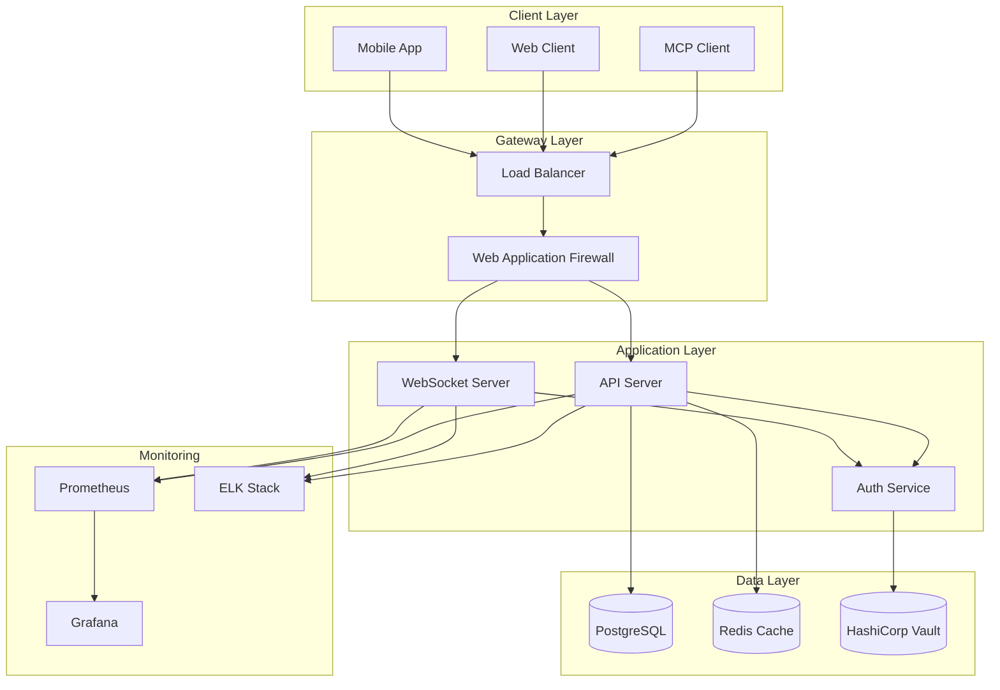

# Secure MCP Server by perfecXion.ai

<div align="center">

```
██████╗ ███████╗██████╗ ███████╗███████╗ ██████╗██╗  ██╗██╗ ██████╗ ███╗   ██╗
██╔══██╗██╔════╝██╔══██╗██╔════╝██╔════╝██╔════╝╚██╗██╔╝██║██╔═══██╗████╗  ██║
██████╔╝█████╗  ██████╔╝█████╗  █████╗  ██║      ╚███╔╝ ██║██║   ██║██╔██╗ ██║
██╔═══╝ ██╔══╝  ██╔══██╗██╔══╝  ██╔══╝  ██║      ██╔██╗ ██║██║   ██║██║╚██╗██║
██║     ███████╗██║  ██║██║     ███████╗╚██████╗██╔╝ ██╗██║╚██████╔╝██║ ╚████║
╚═╝     ╚══════╝╚═╝  ╚═╝╚═╝     ╚══════╝ ╚═════╝╚═╝  ╚═╝╚═╝ ╚═════╝ ╚═╝  ╚═══╝
                                    .ai
```

  <h2>🚀 Enterprise-Grade Model Context Protocol Implementation</h2>
  <p><strong>Developed by the perfecXion.ai Team</strong></p>
  <p>
    <a href="https://perfecxion.ai">Website</a> •
    <a href="https://github.com/perfecxion-ai/secure-mcp">GitHub</a> •
    <a href="https://www.npmjs.com/package/@perfecxion/secure-mcp-server">NPM</a>
  </p>
</div>

---

A production-ready, secure, and scalable Model Context Protocol (MCP) server engineered by **perfecXion.ai** for enterprise deployments. Features advanced security, comprehensive monitoring, and high availability.

## Features

### Core Capabilities
- **Model Context Protocol (MCP) v0.5.0** - Full implementation of the MCP specification
- **WebSocket & HTTP Transport** - Dual transport layer support for flexible client connectivity
- **Tool Management** - Dynamic tool registration, validation, and execution
- **Context Management** - Efficient context handling with configurable limits and caching

### Security Features
- **Multi-Factor Authentication** - JWT + TOTP/SMS-based 2FA
- **SAML 2.0 Integration** - Enterprise SSO support
- **End-to-End Encryption** - TLS 1.3 with certificate pinning
- **Vault Integration** - HashiCorp Vault for secrets management
- **Rate Limiting** - Configurable per-endpoint and per-user limits
- **RBAC** - Role-based access control with granular permissions

### Enterprise Features
- **High Availability** - Multi-region deployment with automatic failover
- **Horizontal Scaling** - Kubernetes-native with auto-scaling
- **Monitoring & Observability** - Prometheus, Grafana, and distributed tracing
- **Audit Logging** - Comprehensive audit trails for compliance
- **Database Support** - PostgreSQL with read replicas and Redis caching
- **Message Queue Integration** - RabbitMQ/Kafka for async processing

## Installation

### NPM Package Installation

#### Server Package
```bash
npm install @perfecxion/secure-mcp-server
```

#### Client SDK
```bash
npm install @perfecxion/secure-mcp-client
```

### Docker Installation
```bash
docker pull perfecxion/secure-mcp-server:latest
```

## Quick Start

### Prerequisites
- Node.js >= 20.0.0
- Docker & Docker Compose
- PostgreSQL 15+
- Redis 7+
- (Optional) Kubernetes cluster for production deployment

### Using NPM Package

```javascript
import { SecureMCPServer } from '@perfecxion/secure-mcp-server';

const server = new SecureMCPServer({
  port: 3000,
  auth: {
    jwt: { secret: process.env.JWT_SECRET },
    apiKeys: true
  }
});

await server.start();
```

### Using Client SDK

```javascript
import { SecureMCPClient } from '@perfecxion/secure-mcp-client';

const client = new SecureMCPClient({
  serverUrl: 'https://mcp.example.com',
  apiKey: 'your-api-key'
});

await client.connect();
const tools = await client.listTools();
```

### Local Development

1. **Clone the repository**
```bash
git clone https://github.com/perfecxion-ai/secure-mcp.git
cd secure-mcp
```

2. **Install dependencies**
```bash
npm install
```

3. **Configure environment**
```bash
cp .env.example .env
# Edit .env with your configuration
```

4. **Start dependencies**
```bash
docker-compose up -d postgres redis vault
```

5. **Initialize database**
```bash
npm run db:migrate
npm run db:generate
```

6. **Initialize Vault**
```bash
npm run vault:init
```

7. **Start the server**
```bash
npm run dev
```

The server will be available at:
- WebSocket: `ws://localhost:3000`
- HTTP API: `http://localhost:3000/api`
- Health Check: `http://localhost:3000/health`
- Metrics: `http://localhost:3000/metrics`

### Docker Deployment

```bash
# Build the image
npm run docker:build

# Run with docker-compose
npm run docker:run
```

### Kubernetes Deployment

```bash
# Deploy to development environment
npm run k8s:deploy

# Deploy to production (requires kubectl context)
kubectl apply -k kubernetes/overlays/production
```

## Architecture Overview



## Project Structure

```
secure-mcp-server/
├── src/                      # Source code
│   ├── auth/                 # Authentication & authorization
│   ├── config/               # Configuration management
│   ├── database/             # Database models & migrations
│   ├── monitoring/           # Metrics & health checks
│   ├── security/             # Security middleware & utilities
│   ├── server/               # WebSocket & HTTP servers
│   ├── tools/                # MCP tool implementations
│   └── utils/                # Utility functions
├── tests/                    # Test suites
│   ├── unit/                 # Unit tests
│   ├── integration/          # Integration tests
│   ├── security/             # Security tests
│   └── performance/          # Performance tests
├── docker/                   # Docker configurations
├── kubernetes/               # Kubernetes manifests
│   ├── base/                 # Base configurations
│   └── overlays/             # Environment-specific overlays
├── scripts/                  # Deployment & utility scripts
├── docs/                     # Documentation
└── monitoring/               # Monitoring configurations
```

## Configuration

The server uses a hierarchical configuration system with environment-specific overrides:

1. **Base Configuration** - `src/config/default.ts`
2. **Environment Variables** - `.env` file
3. **Secrets Management** - HashiCorp Vault
4. **Runtime Configuration** - Kubernetes ConfigMaps

### Key Configuration Options

```typescript
{
  server: {
    port: 3000,
    host: "0.0.0.0",
    corsOrigins: ["http://localhost:*"],
    maxRequestSize: "10mb",
    timeout: 30000
  },
  auth: {
    jwtSecret: process.env.JWT_SECRET,
    jwtExpiry: "1h",
    refreshExpiry: "7d",
    mfaRequired: true,
    sessionTimeout: 3600000
  },
  database: {
    url: process.env.DATABASE_URL,
    maxConnections: 20,
    ssl: { rejectUnauthorized: true }
  },
  redis: {
    host: process.env.REDIS_HOST,
    port: 6379,
    password: process.env.REDIS_PASSWORD,
    tls: true
  },
  security: {
    rateLimit: {
      windowMs: 60000,
      maxRequests: 100
    },
    helmet: {
      contentSecurityPolicy: true,
      hsts: { maxAge: 31536000 }
    }
  }
}
```

## API Documentation

### Authentication Endpoints

#### POST /api/auth/register
Register a new user account.

```bash
curl -X POST http://localhost:3000/api/auth/register \
  -H "Content-Type: application/json" \
  -d '{
    "email": "user@example.com",
    "password": "SecureP@ssw0rd!",
    "name": "John Doe"
  }'
```

#### POST /api/auth/login
Authenticate and receive JWT tokens.

```bash
curl -X POST http://localhost:3000/api/auth/login \
  -H "Content-Type: application/json" \
  -d '{
    "email": "user@example.com",
    "password": "SecureP@ssw0rd!"
  }'
```

#### POST /api/auth/refresh
Refresh access token using refresh token.

```bash
curl -X POST http://localhost:3000/api/auth/refresh \
  -H "Authorization: Bearer <refresh_token>"
```

### WebSocket Connection

```javascript
const WebSocket = require('ws');

const ws = new WebSocket('ws://localhost:3000', {
  headers: {
    'Authorization': 'Bearer <access_token>'
  }
});

ws.on('open', () => {
  // Send MCP request
  ws.send(JSON.stringify({
    jsonrpc: '2.0',
    method: 'tools/list',
    id: 1
  }));
});

ws.on('message', (data) => {
  console.log('Received:', JSON.parse(data));
});
```

## Testing

### Run All Tests
```bash
npm test
```

### Test Categories
```bash
npm run test:unit         # Unit tests
npm run test:integration  # Integration tests
npm run test:security     # Security tests
npm run test:performance  # Performance tests
npm run test:coverage     # Coverage report
```

### Load Testing
```bash
npm run load-test    # Artillery load test
npm run stress-test  # Artillery stress test
npm run benchmark    # Autocannon benchmark
```

## Monitoring

The server exposes comprehensive metrics and health endpoints:

- **Metrics**: `http://localhost:3000/metrics` (Prometheus format)
- **Health**: `http://localhost:3000/health`
- **Ready**: `http://localhost:3000/ready`

### Grafana Dashboards

Access pre-configured dashboards:

```bash
npm run monitor:start
# Open http://localhost:3001 (admin/admin)
```

Available dashboards:
- System Overview
- API Performance
- WebSocket Connections
- Database Performance
- Security Events
- Error Tracking

## Security

### Security Features

1. **Authentication & Authorization**
   - JWT-based authentication with refresh tokens
   - Multi-factor authentication (TOTP/SMS)
   - SAML 2.0 SSO integration
   - Session management with Redis

2. **Data Protection**
   - TLS 1.3 encryption in transit
   - AES-256-GCM encryption at rest
   - Certificate pinning for critical endpoints
   - Secure key rotation

3. **Access Control**
   - Role-based access control (RBAC)
   - Attribute-based access control (ABAC)
   - API key management
   - IP whitelisting

4. **Security Monitoring**
   - Real-time threat detection
   - Audit logging
   - Anomaly detection
   - Security event correlation

### Security Best Practices

- Regular dependency updates via Dependabot
- Security scanning with Snyk
- Penetration testing suite included
- OWASP Top 10 compliance
- SOC 2 Type II ready
- ISO 27001 compliant

## Performance

### Benchmarks

| Metric | Value | Conditions |
|--------|-------|------------|
| Requests/sec | 10,000+ | Single instance, 4 vCPU |
| WebSocket Connections | 50,000+ | Single instance, 8GB RAM |
| P95 Latency | <50ms | Normal load |
| P99 Latency | <100ms | Normal load |
| Throughput | 1GB/s | Data transfer |

### Optimization Features

- Connection pooling
- Redis caching layer
- Database query optimization
- Lazy loading
- Request batching
- Response compression

## Contributing

Please read our [Developer Guide](./docs/DEVELOPER_GUIDE.md) for details on our code of conduct and the process for submitting pull requests.

### Development Workflow

1. Fork the repository
2. Create a feature branch (`git checkout -b feature/amazing-feature`)
3. Commit your changes (`git commit -m 'Add amazing feature'`)
4. Push to the branch (`git push origin feature/amazing-feature`)
5. Open a Pull Request

### Code Standards

- TypeScript strict mode
- ESLint configuration
- Prettier formatting
- 95% test coverage requirement
- Security review required for auth changes

## Support

- **Documentation**: [Full Documentation](./docs/)
- **Issues**: [GitHub Issues](https://github.com/perfecxion-ai/secure-mcp/issues)
- **Security**: security@perfecxion.ai

## License

This project is licensed under the Apache License 2.0 - see the [LICENSE](LICENSE) file for details.

## About perfecXion.ai

### Connect With Us
- 🌐 **Website**: [perfecxion.ai](https://perfecxion.ai)
- 💼 **LinkedIn**: [perfecXion.ai](https://linkedin.com/company/perfecxion-ai)

---

<div align="center">
  <p><strong>Built with ❤️ by the perfecXion.ai Team</strong></p>
  <p>© 2024 perfecXion.ai - Enterprise AI Solutions</p>
</div>
