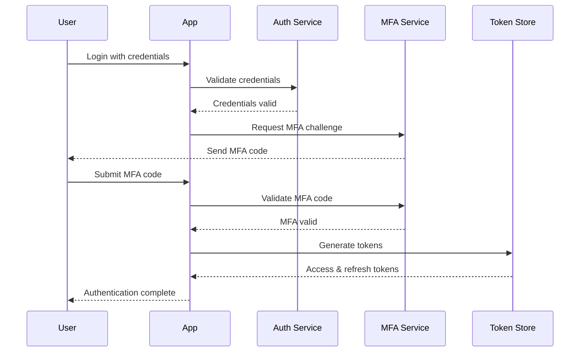

# Security Documentation

## Secure MCP Server - Security Architecture and Controls

### Executive Summary

The Secure MCP Server implements defense-in-depth security architecture with multiple layers of protection, comprehensive threat modeling, and compliance with enterprise security standards including SOC 2 Type II, ISO 27001, and NIST Cybersecurity Framework.

## Table of Contents

1. [Security Architecture](#security-architecture)
2. [Threat Model](#threat-model)
3. [Security Controls](#security-controls)
4. [Authentication & Authorization](#authentication--authorization)
5. [Data Protection](#data-protection)
6. [Network Security](#network-security)
7. [Application Security](#application-security)
8. [Infrastructure Security](#infrastructure-security)
9. [Security Monitoring](#security-monitoring)
10. [Incident Response](#incident-response)
11. [Compliance](#compliance)
12. [Security Best Practices](#security-best-practices)

## Security Architecture

### Defense-in-Depth Layers

```
┌──────────────────────────────────────────────────────────┐
│                    External Perimeter                      │
│  ┌──────────────────────────────────────────────────┐    │
│  │                   CDN / DDoS Protection           │    │
│  └──────────────────────────────────────────────────┘    │
│  ┌──────────────────────────────────────────────────┐    │
│  │              Web Application Firewall (WAF)       │    │
│  └──────────────────────────────────────────────────┘    │
│                                                            │
│                    Network Perimeter                       │
│  ┌──────────────────────────────────────────────────┐    │
│  │                 Load Balancers                    │    │
│  │              (TLS Termination)                    │    │
│  └──────────────────────────────────────────────────┘    │
│  ┌──────────────────────────────────────────────────┐    │
│  │              Network Segmentation                 │    │
│  │                 (VPC/Subnets)                     │    │
│  └──────────────────────────────────────────────────┘    │
│                                                            │
│                  Application Layer                         │
│  ┌──────────────────────────────────────────────────┐    │
│  │            Authentication & Authorization         │    │
│  │                  (JWT + MFA)                      │    │
│  └──────────────────────────────────────────────────┘    │
│  ┌──────────────────────────────────────────────────┐    │
│  │              Input Validation                     │    │
│  │              Output Encoding                      │    │
│  └──────────────────────────────────────────────────┘    │
│  ┌──────────────────────────────────────────────────┐    │
│  │              Rate Limiting                        │    │
│  │              Session Management                   │    │
│  └──────────────────────────────────────────────────┘    │
│                                                            │
│                     Data Layer                             │
│  ┌──────────────────────────────────────────────────┐    │
│  │           Encryption at Rest                      │    │
│  │           Encryption in Transit                   │    │
│  └──────────────────────────────────────────────────┘    │
│  ┌──────────────────────────────────────────────────┐    │
│  │           Database Security                       │    │
│  │           Secret Management (Vault)               │    │
│  └──────────────────────────────────────────────────┘    │
│                                                            │
│                 Monitoring & Audit                         │
│  ┌──────────────────────────────────────────────────┐    │
│  │           Security Monitoring                     │    │
│  │           Audit Logging                           │    │
│  │           Threat Detection                        │    │
│  └──────────────────────────────────────────────────┘    │
└──────────────────────────────────────────────────────────┘
```

### Security Zones

| Zone | Description | Security Level | Access Control |
|------|-------------|---------------|----------------|
| Public DMZ | External-facing services | Low Trust | WAF, DDoS protection |
| Application Zone | MCP servers | Medium Trust | Network segmentation, mTLS |
| Data Zone | Databases, caches | High Trust | Private subnets, encryption |
| Management Zone | Admin services | Critical | VPN, MFA, audit logging |

## Threat Model

### STRIDE Analysis

#### 1. Spoofing Identity

**Threats:**
- Stolen credentials
- Session hijacking
- Token replay attacks
- Phishing attacks

**Mitigations:**
- Multi-factor authentication (TOTP/SMS)
- JWT with short expiration times
- Refresh token rotation
- Session binding to IP/device
- Anti-phishing training

#### 2. Tampering with Data

**Threats:**
- Man-in-the-middle attacks
- SQL injection
- Data manipulation
- Cache poisoning

**Mitigations:**
- TLS 1.3 for all communications
- Input validation and sanitization
- Parameterized queries
- Digital signatures for critical data
- Redis ACLs and authentication

#### 3. Repudiation

**Threats:**
- Denial of actions
- Log tampering
- Unauthorized changes

**Mitigations:**
- Comprehensive audit logging
- Log integrity protection
- Centralized log management
- Digital signatures on transactions
- Immutable audit trail

#### 4. Information Disclosure

**Threats:**
- Data breaches
- Unauthorized access
- Information leakage
- Side-channel attacks

**Mitigations:**
- Encryption at rest (AES-256)
- Encryption in transit (TLS 1.3)
- Data classification and labeling
- Least privilege access
- Secure error handling

#### 5. Denial of Service

**Threats:**
- DDoS attacks
- Resource exhaustion
- Application layer attacks
- Database connection exhaustion

**Mitigations:**
- CloudFlare DDoS protection
- Rate limiting per endpoint
- Connection pooling
- Circuit breakers
- Auto-scaling

#### 6. Elevation of Privilege

**Threats:**
- Privilege escalation
- Unauthorized admin access
- Container escape
- Kernel exploits

**Mitigations:**
- Role-based access control (RBAC)
- Principle of least privilege
- Container security policies
- Regular security updates
- Runtime security monitoring

### Attack Surface Analysis

```yaml
Attack Surfaces:
  API Endpoints:
    - Authentication endpoints
    - Tool execution endpoints
    - Admin endpoints
    Risk: High
    Controls: Rate limiting, input validation, authentication

  WebSocket Connections:
    - Connection establishment
    - Message handling
    - Session management
    Risk: Medium
    Controls: Token validation, message validation, timeout

  Database:
    - SQL queries
    - Connection strings
    - Stored procedures
    Risk: High
    Controls: Parameterized queries, connection encryption, access control

  File System:
    - Log files
    - Temporary files
    - Configuration files
    Risk: Medium
    Controls: File permissions, encryption, secure deletion

  Dependencies:
    - NPM packages
    - Docker images
    - System libraries
    Risk: Medium
    Controls: Dependency scanning, version pinning, security updates
```

## Security Controls

### Technical Controls

#### Authentication Controls

```typescript
// JWT Configuration
const jwtConfig = {
  algorithm: 'RS256',
  issuer: 'https://api.secure-mcp.enterprise.com',
  audience: 'mcp-clients',
  expiresIn: '1h',
  notBefore: '0s',
  keyRotation: true,
  keyRotationInterval: '7d'
};

// Password Policy
const passwordPolicy = {
  minLength: 12,
  requireUppercase: true,
  requireLowercase: true,
  requireNumbers: true,
  requireSpecialChars: true,
  preventReuse: 10,
  maxAge: 90, // days
  preventCommonPasswords: true
};

// MFA Configuration
const mfaConfig = {
  required: true,
  methods: ['totp', 'sms', 'webauthn'],
  backupCodes: 10,
  totpWindow: 1,
  smsTimeout: 300, // seconds
  webauthnTimeout: 60000 // milliseconds
};
```

#### Input Validation

```typescript
// Request validation middleware
import { body, param, query, validationResult } from 'express-validator';

const toolExecutionValidation = [
  body('toolId')
    .isString()
    .matches(/^[a-zA-Z0-9_-]+$/)
    .isLength({ min: 3, max: 50 }),
  body('parameters')
    .isObject()
    .custom((value) => {
      // Deep validation of parameters
      return validateAgainstSchema(value);
    }),
  body('timeout')
    .optional()
    .isInt({ min: 1000, max: 300000 })
];

// SQL Injection prevention
const sanitizeInput = (input: string): string => {
  return input
    .replace(/[^\w\s-]/gi, '') // Remove special characters
    .trim()
    .substring(0, 255); // Limit length
};

// XSS Prevention
import DOMPurify from 'isomorphic-dompurify';

const sanitizeHtml = (dirty: string): string => {
  return DOMPurify.sanitize(dirty, {
    ALLOWED_TAGS: ['b', 'i', 'em', 'strong', 'a'],
    ALLOWED_ATTR: ['href']
  });
};
```

#### Encryption Implementation

```typescript
// Encryption utilities
import crypto from 'crypto';

class EncryptionService {
  private algorithm = 'aes-256-gcm';
  private keyDerivation = 'pbkdf2';
  private iterations = 100000;
  private keyLength = 32;
  private saltLength = 16;
  private tagLength = 16;
  private ivLength = 16;

  async encryptData(plaintext: string, masterKey: string): Promise<EncryptedData> {
    const salt = crypto.randomBytes(this.saltLength);
    const iv = crypto.randomBytes(this.ivLength);

    const key = crypto.pbkdf2Sync(
      masterKey,
      salt,
      this.iterations,
      this.keyLength,
      'sha256'
    );

    const cipher = crypto.createCipheriv(this.algorithm, key, iv);

    let encrypted = cipher.update(plaintext, 'utf8', 'hex');
    encrypted += cipher.final('hex');

    const authTag = cipher.getAuthTag();

    return {
      encrypted,
      salt: salt.toString('hex'),
      iv: iv.toString('hex'),
      authTag: authTag.toString('hex'),
      algorithm: this.algorithm,
      iterations: this.iterations
    };
  }

  async decryptData(encryptedData: EncryptedData, masterKey: string): Promise<string> {
    const salt = Buffer.from(encryptedData.salt, 'hex');
    const iv = Buffer.from(encryptedData.iv, 'hex');
    const authTag = Buffer.from(encryptedData.authTag, 'hex');

    const key = crypto.pbkdf2Sync(
      masterKey,
      salt,
      encryptedData.iterations,
      this.keyLength,
      'sha256'
    );

    const decipher = crypto.createDecipheriv(this.algorithm, key, iv);
    decipher.setAuthTag(authTag);

    let decrypted = decipher.update(encryptedData.encrypted, 'hex', 'utf8');
    decrypted += decipher.final('utf8');

    return decrypted;
  }

  generateSecureToken(length: number = 32): string {
    return crypto.randomBytes(length).toString('hex');
  }

  hashPassword(password: string): Promise<string> {
    return bcrypt.hash(password, 12);
  }

  verifyPassword(password: string, hash: string): Promise<boolean> {
    return bcrypt.compare(password, hash);
  }
}
```

### Administrative Controls

#### Security Policies

1. **Access Control Policy**
   - Principle of least privilege
   - Role-based access control
   - Regular access reviews
   - Automated de-provisioning

2. **Data Classification Policy**
   - Public, Internal, Confidential, Restricted
   - Handling requirements per classification
   - Encryption requirements
   - Retention policies

3. **Incident Response Policy**
   - 24/7 incident response team
   - Escalation procedures
   - Communication protocols
   - Post-incident reviews

4. **Change Management Policy**
   - Security review for all changes
   - Automated testing requirements
   - Rollback procedures
   - Change approval workflow

### Physical Controls

1. **Data Center Security**
   - 24/7 physical security
   - Biometric access controls
   - Environmental monitoring
   - Redundant power and cooling

2. **Hardware Security**
   - Secure boot
   - TPM modules
   - Hardware encryption
   - Secure disposal procedures

## Authentication & Authorization

### Multi-Factor Authentication Flow



### RBAC Implementation

```typescript
// Role definitions
const roles = {
  ADMIN: {
    permissions: ['*'],
    inherits: []
  },
  DEVELOPER: {
    permissions: [
      'tools:read',
      'tools:write',
      'tools:execute',
      'contexts:read',
      'contexts:write'
    ],
    inherits: ['USER']
  },
  USER: {
    permissions: [
      'tools:read',
      'tools:execute',
      'contexts:read',
      'profile:read',
      'profile:write'
    ],
    inherits: []
  },
  VIEWER: {
    permissions: [
      'tools:read',
      'contexts:read',
      'profile:read'
    ],
    inherits: []
  }
};

// Permission middleware
const requirePermission = (permission: string) => {
  return async (req: Request, res: Response, next: NextFunction) => {
    const user = req.user;
    const userPermissions = getUserPermissions(user.roles);

    if (userPermissions.includes('*') || userPermissions.includes(permission)) {
      next();
    } else {
      res.status(403).json({
        error: 'FORBIDDEN',
        message: 'Insufficient permissions',
        required: permission
      });
    }
  };
};
```

### Session Management

```typescript
// Session configuration
const sessionConfig = {
  secret: process.env.SESSION_SECRET,
  name: 'mcp.sid',
  resave: false,
  saveUninitialized: false,
  rolling: true,
  cookie: {
    secure: true,
    httpOnly: true,
    sameSite: 'strict',
    maxAge: 3600000, // 1 hour
    domain: '.secure-mcp.enterprise.com'
  },
  store: new RedisStore({
    client: redisClient,
    prefix: 'sess:',
    ttl: 3600
  })
};

// Session validation
const validateSession = async (sessionId: string): Promise<boolean> => {
  const session = await sessionStore.get(sessionId);

  if (!session) return false;

  // Check session expiry
  if (session.expiresAt < Date.now()) {
    await sessionStore.delete(sessionId);
    return false;
  }

  // Check session binding
  if (session.ipAddress !== req.ip || session.userAgent !== req.get('User-Agent')) {
    await sessionStore.delete(sessionId);
    await auditLog.warn('Session binding mismatch', { sessionId });
    return false;
  }

  return true;
};
```

## Data Protection

### Encryption Standards

| Data Type | At Rest | In Transit | Key Management |
|-----------|---------|------------|----------------|
| User Credentials | Argon2id | TLS 1.3 | N/A (hashed) |
| JWT Tokens | N/A | TLS 1.3 | RSA 4096 |
| Database | AES-256-GCM | TLS 1.3 | Vault KMS |
| File Storage | AES-256-GCM | TLS 1.3 | Vault KMS |
| Backups | AES-256-GCM | TLS 1.3 | Offline keys |
| Logs | AES-256-GCM | TLS 1.3 | Vault KMS |

### Key Management

```bash
# Generate master encryption key
openssl rand -hex 32 > master-key.txt

# Store in Vault
vault kv put secret/mcp/encryption \
  master_key="$(cat master-key.txt)" \
  created_at="$(date -u +%Y-%m-%dT%H:%M:%SZ)" \
  rotation_schedule="90d"

# Key rotation script
#!/bin/bash
OLD_KEY=$(vault kv get -field=master_key secret/mcp/encryption)
NEW_KEY=$(openssl rand -hex 32)

# Re-encrypt data with new key
./scripts/rotate-encryption-key.sh $OLD_KEY $NEW_KEY

# Update Vault
vault kv put secret/mcp/encryption \
  master_key="$NEW_KEY" \
  previous_key="$OLD_KEY" \
  rotated_at="$(date -u +%Y-%m-%dT%H:%M:%SZ)"
```

### Data Loss Prevention

```typescript
// DLP Rules
const dlpRules = [
  {
    name: 'Credit Card Detection',
    pattern: /\b(?:\d[ -]*?){13,16}\b/,
    action: 'block',
    alert: true
  },
  {
    name: 'SSN Detection',
    pattern: /\b\d{3}-\d{2}-\d{4}\b/,
    action: 'redact',
    alert: true
  },
  {
    name: 'API Key Detection',
    pattern: /\b[A-Za-z0-9]{32,}\b/,
    action: 'alert',
    alert: true
  }
];

// DLP middleware
const dlpMiddleware = (req: Request, res: Response, next: NextFunction) => {
  const originalSend = res.send;

  res.send = function(data: any) {
    let processedData = data;

    if (typeof data === 'string') {
      dlpRules.forEach(rule => {
        if (rule.pattern.test(data)) {
          auditLog.alert(`DLP violation: ${rule.name}`, {
            userId: req.user?.id,
            endpoint: req.path
          });

          if (rule.action === 'block') {
            return res.status(403).json({
              error: 'DLP_VIOLATION',
              message: 'Response contains sensitive data'
            });
          } else if (rule.action === 'redact') {
            processedData = data.replace(rule.pattern, '[REDACTED]');
          }
        }
      });
    }

    return originalSend.call(this, processedData);
  };

  next();
};
```

## Network Security

### Network Segmentation

```yaml
Network Segments:
  Public Subnet (10.0.1.0/24):
    - Load Balancers
    - NAT Gateways
    - Bastion Hosts

  Application Subnet (10.0.2.0/24):
    - MCP Servers
    - API Servers
    - WebSocket Servers

  Data Subnet (10.0.3.0/24):
    - PostgreSQL
    - Redis
    - Elasticsearch

  Management Subnet (10.0.4.0/24):
    - Monitoring Services
    - Log Aggregation
    - Admin Interfaces
```

### Firewall Rules

```bash
# Ingress Rules
aws ec2 authorize-security-group-ingress \
  --group-id sg-app \
  --protocol tcp \
  --port 443 \
  --source-group sg-lb

aws ec2 authorize-security-group-ingress \
  --group-id sg-db \
  --protocol tcp \
  --port 5432 \
  --source-group sg-app

# Egress Rules
aws ec2 authorize-security-group-egress \
  --group-id sg-app \
  --protocol tcp \
  --port 443 \
  --cidr 0.0.0.0/0

# Network ACLs
aws ec2 create-network-acl-entry \
  --network-acl-id acl-data \
  --rule-number 100 \
  --protocol tcp \
  --rule-action deny \
  --ingress \
  --port-range From=0,To=65535 \
  --cidr-block 0.0.0.0/0
```

### TLS Configuration

```nginx
# nginx.conf
server {
    listen 443 ssl http2;
    server_name api.secure-mcp.enterprise.com;

    # SSL Configuration
    ssl_certificate /etc/nginx/ssl/cert.pem;
    ssl_certificate_key /etc/nginx/ssl/key.pem;
    ssl_protocols TLSv1.3;
    ssl_ciphers ECDHE-RSA-AES256-GCM-SHA512:DHE-RSA-AES256-GCM-SHA512;
    ssl_prefer_server_ciphers off;
    ssl_session_cache shared:SSL:10m;
    ssl_session_timeout 10m;
    ssl_session_tickets off;
    ssl_stapling on;
    ssl_stapling_verify on;

    # Security Headers
    add_header Strict-Transport-Security "max-age=31536000; includeSubDomains; preload" always;
    add_header X-Frame-Options "DENY" always;
    add_header X-Content-Type-Options "nosniff" always;
    add_header X-XSS-Protection "1; mode=block" always;
    add_header Content-Security-Policy "default-src 'self'; script-src 'self' 'unsafe-inline'; style-src 'self' 'unsafe-inline';" always;
    add_header Referrer-Policy "strict-origin-when-cross-origin" always;
}
```

## Application Security

### Secure Coding Practices

```typescript
// Secure random number generation
import crypto from 'crypto';

const generateSecureRandom = (bytes: number = 32): string => {
  return crypto.randomBytes(bytes).toString('hex');
};

// Secure comparison to prevent timing attacks
const secureCompare = (a: string, b: string): boolean => {
  if (a.length !== b.length) return false;
  return crypto.timingSafeEqual(Buffer.from(a), Buffer.from(b));
};

// SQL injection prevention with parameterized queries
const getUserById = async (userId: string): Promise<User> => {
  const query = 'SELECT * FROM users WHERE id = $1';
  const result = await db.query(query, [userId]);
  return result.rows[0];
};

// Command injection prevention
import { spawn } from 'child_process';

const executeCommand = (command: string, args: string[]): Promise<string> => {
  return new Promise((resolve, reject) => {
    // Never use shell: true
    const child = spawn(command, args, {
      shell: false,
      env: {
        ...process.env,
        PATH: '/usr/bin:/bin' // Restricted PATH
      }
    });

    let output = '';
    child.stdout.on('data', (data) => {
      output += data.toString();
    });

    child.on('close', (code) => {
      if (code === 0) {
        resolve(output);
      } else {
        reject(new Error(`Command failed with code ${code}`));
      }
    });
  });
};
```

### Dependency Security

```json
// package.json security scripts
{
  "scripts": {
    "security:audit": "npm audit --production",
    "security:fix": "npm audit fix --force",
    "security:check": "snyk test",
    "security:monitor": "snyk monitor",
    "security:update": "npm-check-updates -u && npm install",
    "security:licenses": "license-checker --production --summary"
  }
}
```

```bash
# Automated dependency scanning
#!/bin/bash

# Run npm audit
npm audit --json > audit-report.json

# Check for critical vulnerabilities
CRITICAL=$(jq '.metadata.vulnerabilities.critical' audit-report.json)
HIGH=$(jq '.metadata.vulnerabilities.high' audit-report.json)

if [ "$CRITICAL" -gt 0 ] || [ "$HIGH" -gt 0 ]; then
  echo "Critical or high vulnerabilities found!"
  exit 1
fi

# Snyk scanning
snyk test --severity-threshold=high

# OWASP dependency check
dependency-check.sh \
  --project "Secure MCP Server" \
  --scan ./package-lock.json \
  --format JSON \
  --out ./dependency-check-report.json \
  --suppression ./suppression.xml
```

### Container Security

```dockerfile
# Dockerfile security best practices
FROM node:20-alpine AS base

# Run as non-root user
RUN addgroup -g 1001 -S nodejs && \
    adduser -S nodejs -u 1001

# Security updates
RUN apk update && \
    apk upgrade && \
    apk add --no-cache \
      dumb-init \
      && rm -rf /var/cache/apk/*

# Production stage
FROM base AS production

WORKDIR /app

# Copy only necessary files
COPY --chown=nodejs:nodejs package*.json ./
RUN npm ci --only=production && \
    npm cache clean --force

COPY --chown=nodejs:nodejs dist ./dist

# Security scanning labels
LABEL security.scan="true" \
      security.scan.tool="trivy" \
      security.compliance="cis-docker-benchmark"

# Switch to non-root user
USER nodejs

# Use dumb-init to handle signals
ENTRYPOINT ["dumb-init", "--"]
CMD ["node", "dist/index.js"]

# Health check
HEALTHCHECK --interval=30s --timeout=3s --start-period=5s --retries=3 \
  CMD node healthcheck.js
```

```yaml
# Pod Security Policy
apiVersion: policy/v1beta1
kind: PodSecurityPolicy
metadata:
  name: mcp-security-policy
spec:
  privileged: false
  allowPrivilegeEscalation: false
  requiredDropCapabilities:
    - ALL
  volumes:
    - 'configMap'
    - 'emptyDir'
    - 'projected'
    - 'secret'
    - 'downwardAPI'
    - 'persistentVolumeClaim'
  hostNetwork: false
  hostIPC: false
  hostPID: false
  runAsUser:
    rule: 'MustRunAsNonRoot'
  seLinux:
    rule: 'RunAsAny'
  supplementalGroups:
    rule: 'RunAsAny'
  fsGroup:
    rule: 'RunAsAny'
  readOnlyRootFilesystem: true
```

## Security Monitoring

### Security Information and Event Management (SIEM)

```typescript
// Security event logging
class SecurityLogger {
  private siem: SIEMClient;

  constructor() {
    this.siem = new SIEMClient({
      endpoint: process.env.SIEM_ENDPOINT,
      apiKey: process.env.SIEM_API_KEY
    });
  }

  async logSecurityEvent(event: SecurityEvent): Promise<void> {
    const enrichedEvent = {
      ...event,
      timestamp: new Date().toISOString(),
      hostname: os.hostname(),
      processId: process.pid,
      environment: process.env.NODE_ENV,
      correlationId: generateCorrelationId()
    };

    // Send to SIEM
    await this.siem.send(enrichedEvent);

    // Local logging
    logger.security(enrichedEvent);

    // Critical events trigger alerts
    if (event.severity === 'critical') {
      await this.triggerAlert(enrichedEvent);
    }
  }

  async logAuthenticationFailure(userId: string, reason: string, metadata: any): Promise<void> {
    await this.logSecurityEvent({
      type: 'authentication_failure',
      severity: 'warning',
      userId,
      reason,
      metadata,
      category: 'authentication'
    });
  }

  async logAuthorizationFailure(userId: string, resource: string, action: string): Promise<void> {
    await this.logSecurityEvent({
      type: 'authorization_failure',
      severity: 'warning',
      userId,
      resource,
      action,
      category: 'authorization'
    });
  }

  async logSuspiciousActivity(userId: string, activity: string, risk_score: number): Promise<void> {
    await this.logSecurityEvent({
      type: 'suspicious_activity',
      severity: risk_score > 80 ? 'critical' : 'warning',
      userId,
      activity,
      risk_score,
      category: 'threat_detection'
    });
  }
}
```

### Intrusion Detection

```yaml
# Falco rules for runtime security
- rule: Unauthorized Process
  desc: Detect unauthorized process execution
  condition: >
    spawned_process and
    container and
    container.image.repository = "secure-mcp-server" and
    not proc.name in (node, npm, sh)
  output: >
    Unauthorized process started
    (user=%user.name command=%proc.cmdline container=%container.id)
  priority: WARNING

- rule: Write to System Directory
  desc: Detect writes to system directories
  condition: >
    open_write and
    container and
    (fd.name startswith /etc or
     fd.name startswith /usr or
     fd.name startswith /bin)
  output: >
    Write to system directory
    (user=%user.name file=%fd.name container=%container.id)
  priority: ERROR

- rule: Network Connection to Suspicious IP
  desc: Detect connections to suspicious IPs
  condition: >
    outbound and
    container and
    not (fd.ip in (trusted_ips))
  output: >
    Suspicious network connection
    (container=%container.id connection=%fd.name)
  priority: WARNING
```

### Security Metrics and KPIs

```typescript
// Security metrics collection
const securityMetrics = {
  authenticationAttempts: new prometheus.Counter({
    name: 'auth_attempts_total',
    help: 'Total authentication attempts',
    labelNames: ['status', 'method']
  }),

  authorizationFailures: new prometheus.Counter({
    name: 'authz_failures_total',
    help: 'Total authorization failures',
    labelNames: ['resource', 'action']
  }),

  securityViolations: new prometheus.Counter({
    name: 'security_violations_total',
    help: 'Total security violations',
    labelNames: ['type', 'severity']
  }),

  encryptionOperations: new prometheus.Histogram({
    name: 'encryption_duration_seconds',
    help: 'Encryption operation duration',
    labelNames: ['operation', 'algorithm']
  }),

  vulnerabilitiesDetected: new prometheus.Gauge({
    name: 'vulnerabilities_detected',
    help: 'Number of vulnerabilities detected',
    labelNames: ['severity']
  })
};
```

## Incident Response

### Incident Response Plan

#### 1. Detection Phase

```bash
# Automated detection rules
alert SecurityIncident {
  expr: |
    rate(security_violations_total[5m]) > 10 or
    rate(auth_failures_total[5m]) > 20 or
    suspicious_activity_score > 80
  for: 2m
  labels:
    severity: critical
    team: security
  annotations:
    summary: "Security incident detected"
    description: "{{ $labels.instance }} has triggered security alert"
}
```

#### 2. Containment Phase

```typescript
// Automated containment actions
class IncidentContainment {
  async containUser(userId: string, reason: string): Promise<void> {
    // Suspend user account
    await userService.suspend(userId);

    // Terminate all active sessions
    await sessionService.terminateAllSessions(userId);

    // Revoke all tokens
    await tokenService.revokeAllTokens(userId);

    // Block IP addresses
    const sessions = await sessionService.getUserSessions(userId);
    for (const session of sessions) {
      await firewallService.blockIP(session.ipAddress, reason);
    }

    // Log incident
    await securityLogger.logIncident({
      type: 'user_containment',
      userId,
      reason,
      actions: ['account_suspended', 'sessions_terminated', 'tokens_revoked', 'ips_blocked']
    });
  }

  async isolateContainer(containerId: string): Promise<void> {
    // Disconnect from network
    await docker.disconnectNetwork(containerId);

    // Capture forensic data
    await this.captureForensics(containerId);

    // Stop container
    await docker.stopContainer(containerId);
  }
}
```

#### 3. Investigation Phase

```bash
# Forensic data collection script
#!/bin/bash

INCIDENT_ID=$1
CONTAINER_ID=$2

# Create incident directory
mkdir -p /forensics/$INCIDENT_ID

# Capture container logs
docker logs $CONTAINER_ID > /forensics/$INCIDENT_ID/container.log 2>&1

# Capture process list
docker exec $CONTAINER_ID ps auxf > /forensics/$INCIDENT_ID/processes.txt

# Capture network connections
docker exec $CONTAINER_ID netstat -tulpn > /forensics/$INCIDENT_ID/network.txt

# Capture file system changes
docker diff $CONTAINER_ID > /forensics/$INCIDENT_ID/filesystem_changes.txt

# Create container image for analysis
docker commit $CONTAINER_ID forensics:$INCIDENT_ID

# Generate timeline
docker events --since 1h --until now > /forensics/$INCIDENT_ID/timeline.txt

# Calculate hashes for integrity
find /forensics/$INCIDENT_ID -type f -exec sha256sum {} \; > /forensics/$INCIDENT_ID/hashes.txt
```

#### 4. Recovery Phase

```typescript
// Recovery procedures
class IncidentRecovery {
  async restoreService(): Promise<void> {
    // Verify system integrity
    const integrityCheck = await this.verifySystemIntegrity();
    if (!integrityCheck.passed) {
      throw new Error('System integrity check failed');
    }

    // Restore from clean backup
    await this.restoreFromBackup();

    // Apply security patches
    await this.applySecurityPatches();

    // Reset credentials
    await this.rotateAllCredentials();

    // Enable monitoring
    await this.enableEnhancedMonitoring();

    // Gradual service restoration
    await this.gradualServiceRestore();
  }

  async postIncidentActions(): Promise<void> {
    // Generate incident report
    const report = await this.generateIncidentReport();

    // Update security controls
    await this.updateSecurityControls(report.recommendations);

    // Conduct lessons learned session
    await this.scheduleLessonsLearned();

    // Update documentation
    await this.updateRunbooks(report.findings);
  }
}
```

### Incident Communication

```yaml
# Incident communication matrix
communication_matrix:
  P1_Critical:
    internal:
      - ciso@enterprise.com
      - cto@enterprise.com
      - legal@enterprise.com
    external:
      - customers (if data breach)
      - law enforcement (if criminal)
      - regulatory bodies (if compliance)
    timeline: immediate

  P2_High:
    internal:
      - security-team@enterprise.com
      - ops-team@enterprise.com
    external:
      - affected partners
    timeline: within 1 hour

  P3_Medium:
    internal:
      - security-team@enterprise.com
    external: none
    timeline: within 4 hours
```

## Compliance

### Compliance Frameworks

#### SOC 2 Type II Controls

```yaml
SOC2_Controls:
  CC1_Control_Environment:
    - Security awareness training
    - Background checks
    - Code of conduct

  CC2_Communication_Information:
    - Security policies documentation
    - Incident reporting procedures
    - Customer communication protocols

  CC3_Risk_Assessment:
    - Annual risk assessments
    - Threat modeling
    - Vulnerability scanning

  CC4_Monitoring:
    - Continuous security monitoring
    - Log analysis
    - Security metrics tracking

  CC5_Control_Activities:
    - Access control procedures
    - Change management
    - Configuration management

  CC6_Logical_Access:
    - Authentication controls
    - Authorization matrix
    - Privileged access management

  CC7_System_Operations:
    - Incident response procedures
    - Backup and recovery
    - Capacity planning

  CC8_Change_Management:
    - Change approval process
    - Testing procedures
    - Rollback procedures

  CC9_Risk_Mitigation:
    - Risk treatment plans
    - Control implementation
    - Insurance coverage
```

#### ISO 27001 Controls

```yaml
ISO_27001_Controls:
  A5_Information_Security_Policies:
    implemented: true
    evidence:
      - /docs/security-policy.pdf
      - /docs/acceptable-use-policy.pdf

  A6_Organization_Security:
    implemented: true
    evidence:
      - /docs/roles-responsibilities.pdf
      - /docs/security-organization.pdf

  A7_Human_Resource_Security:
    implemented: true
    evidence:
      - /hr/background-checks/
      - /hr/security-training/

  A8_Asset_Management:
    implemented: true
    evidence:
      - /inventory/assets.xlsx
      - /inventory/data-classification.xlsx

  A9_Access_Control:
    implemented: true
    evidence:
      - /access/rbac-matrix.xlsx
      - /access/user-access-reviews/

  A10_Cryptography:
    implemented: true
    evidence:
      - /crypto/key-management.pdf
      - /crypto/encryption-standards.pdf

  A11_Physical_Security:
    implemented: true
    evidence:
      - /physical/datacenter-security.pdf
      - /physical/access-logs/

  A12_Operations_Security:
    implemented: true
    evidence:
      - /ops/change-management/
      - /ops/vulnerability-management/

  A13_Communications_Security:
    implemented: true
    evidence:
      - /network/network-security.pdf
      - /network/segmentation.pdf

  A14_Development_Security:
    implemented: true
    evidence:
      - /dev/secure-coding-standards.pdf
      - /dev/security-testing/
```

### Audit Logging

```typescript
// Comprehensive audit logging
class AuditLogger {
  private readonly requiredFields = [
    'timestamp',
    'userId',
    'action',
    'resource',
    'result',
    'ipAddress',
    'userAgent'
  ];

  async log(event: AuditEvent): Promise<void> {
    // Validate required fields
    this.validateEvent(event);

    // Add metadata
    const auditEntry = {
      ...event,
      id: uuid(),
      timestamp: new Date().toISOString(),
      hostname: os.hostname(),
      version: '1.0',
      signature: this.signEvent(event)
    };

    // Store in multiple locations for redundancy
    await Promise.all([
      this.storeInDatabase(auditEntry),
      this.storeInFile(auditEntry),
      this.sendToSIEM(auditEntry)
    ]);
  }

  private signEvent(event: AuditEvent): string {
    const data = JSON.stringify(event);
    const signature = crypto
      .createHmac('sha256', process.env.AUDIT_SIGNING_KEY)
      .update(data)
      .digest('hex');
    return signature;
  }

  async queryAuditLogs(criteria: QueryCriteria): Promise<AuditEntry[]> {
    // Ensure query is authorized
    await this.authorizeQuery(criteria.requestor);

    // Query with filters
    const logs = await db.query(`
      SELECT * FROM audit_logs
      WHERE timestamp >= $1
        AND timestamp <= $2
        AND ($3::text IS NULL OR userId = $3)
        AND ($4::text IS NULL OR action = $4)
      ORDER BY timestamp DESC
      LIMIT $5
    `, [
      criteria.startDate,
      criteria.endDate,
      criteria.userId,
      criteria.action,
      criteria.limit || 1000
    ]);

    // Verify signatures
    return logs.filter(log => this.verifySignature(log));
  }
}
```

## Security Best Practices

### Development Security Checklist

- [ ] Input validation on all user inputs
- [ ] Output encoding for all outputs
- [ ] Parameterized queries for database access
- [ ] Secure session management
- [ ] Strong authentication mechanisms
- [ ] Proper error handling without information leakage
- [ ] Secure communication (TLS/SSL)
- [ ] Security headers implementation
- [ ] Rate limiting on all endpoints
- [ ] Security testing in CI/CD pipeline
- [ ] Dependency vulnerability scanning
- [ ] Code security review
- [ ] Penetration testing
- [ ] Security documentation updated

### Operational Security Checklist

- [ ] Regular security patches applied
- [ ] Security monitoring active
- [ ] Audit logs reviewed regularly
- [ ] Access reviews conducted quarterly
- [ ] Incident response plan tested
- [ ] Backup and recovery tested
- [ ] Security metrics tracked
- [ ] Compliance audits completed
- [ ] Security training conducted
- [ ] Third-party security assessments
- [ ] Vulnerability scanning performed
- [ ] Security policies reviewed annually
- [ ] Disaster recovery plan tested
- [ ] Security insurance reviewed

### Security Contact Information

**Security Team**
- Email: security@enterprise.com
- Phone: +1-555-SEC-RITY (24/7)
- PagerDuty: security-oncall

**Incident Response**
- Email: incident-response@enterprise.com
- Phone: +1-555-INCIDENT (24/7)
- Slack: #security-incidents

**Security Reports**
- Email: security-reports@enterprise.com
- Bug Bounty: https://hackerone.com/secure-mcp

**Compliance**
- Email: compliance@enterprise.com
- Phone: +1-555-COMPLY-1

## Security Resources

### Documentation
- [OWASP Top 10](https://owasp.org/www-project-top-ten/)
- [NIST Cybersecurity Framework](https://www.nist.gov/cyberframework)
- [CIS Controls](https://www.cisecurity.org/controls)
- [SANS Security Resources](https://www.sans.org/security-resources)

### Tools
- [Snyk](https://snyk.io/) - Vulnerability scanning
- [Vault](https://www.vaultproject.io/) - Secret management
- [Falco](https://falco.org/) - Runtime security
- [OWASP ZAP](https://www.zaproxy.org/) - Security testing

### Training
- Security awareness training: Quarterly
- Secure coding training: Bi-annually
- Incident response drills: Quarterly
- Compliance training: Annually